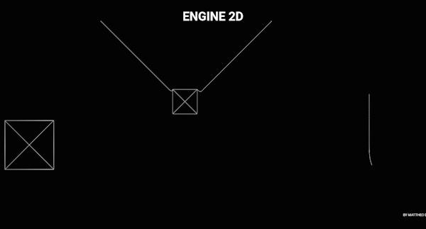

<h1>Engine 2d</h1>

It's a librairy to code quickly some simulation 2d like squares, flags, clothes and ropes.

<h3>Needs</h3>

Installation
<code> ~$ npm install </code> 
Then you run it in development mode
<code> ~$ npm start </code> 

If you want it less buggy, you can build the project
<code> ~$ npm run build </code> 
<code> ~$ sudo npm install -g serve </code> 

Then run it
<code> ~$ serve -s build </code> 

<h3>Simulation</h3>

Multiple simulation that you can do

Flag simulation (cloth dressed in flag)

Boxes and ropes simulation

Cloth simulation

